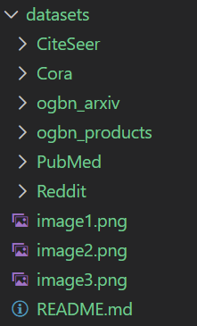
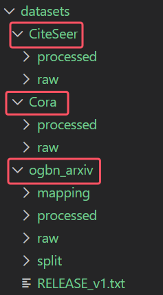
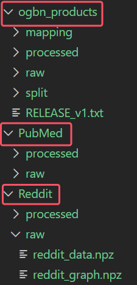

# 加载GNN数据集的两大方法

## 1  使用图深度学习框架内置的Dataset类

使用PyG、DGL等主流框架，加载标准/流行的公开数据集。

方法：运行`examples`文件夹内的`02-dataset.ipynb`

## 2  手动下载并保存到本目录中

通过官方源链接进行下载。

Cora: https://linqs-data.soe.ucsc.edu/public/lbc/cora.tgz

CiteSeer: https://linqs-data.soe.ucsc.edu/public/lbc/citeseer.tgz

PubMed: https://linqs-data.soe.ucsc.edu/public/lbc/pubmed.tgz

Reddit: https://data.dgl.ai/dataset/reddit.zip

ogbn-arxiv: https://snap.stanford.edu/ogb/data/nodeproppred/arxiv.zip

ogbn-products: https://snap.stanford.edu/ogb/data/nodeproppred/products.zip

## 3  完成加载数据集后，本文件夹目录结构如下

### 3.1  整体

### 3.2  各数据集内部

